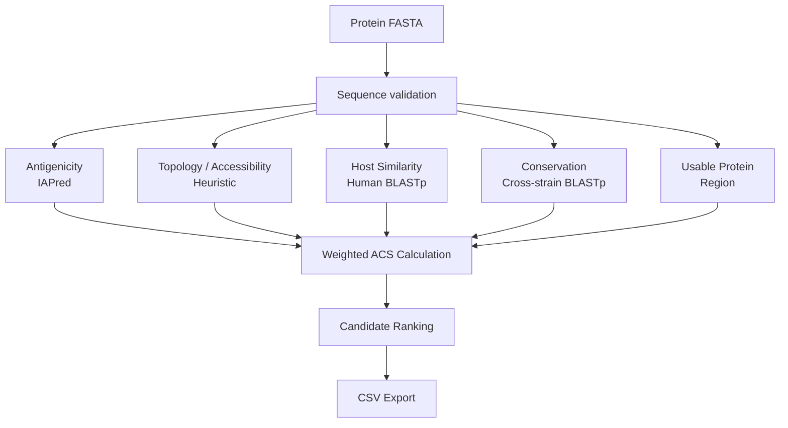

<p align="center">

</p>

# 🧬 MemVax-Py

### *An Integrative Computational Pipeline for Vaccine Antigen Candidate Prioritization Across Diverse Pathogens*
<br>
<p align="center">


</p>

---

# 📑 Table of Contents

- <a href="#project-overview">Project Overview</a>
- <a href="#research-question">Research Question</a>
- <a href="#supported-pathogens">Supported Pathogens</a>
- <a href="#candidate-dataset">Candidate Dataset</a>
- <a href="#objectives">Objectives</a>
- <a href="#repository-structure">Repository Structure</a>
- <a href="#installation">Installation</a>
- <a href="#requirements">Requirements</a>
- <a href="#project-workflow">Project Workflow</a>
- <a href="#module-1-antigenicity">Module 1: Antigenicity</a>
- <a href="#module-2-topology--accessibility">Module 2: Topology / Accessibility</a>
- <a href="#module-3-host-similarity">Module 3: Host Similarity</a>
- <a href="#module-4-pathogen-conservation">Module 4: Pathogen Conservation</a>
- <a href="#module-5-usable-protein-region">Module 5: Usable Protein Region</a>
- <a href="#antigen-candidacy-score">Antigen Candidacy Score</a>
- <a href="#validation-and-evaluation">Validation and Evaluation</a>
- <a href="#ablation-analysis">Ablation Analysis</a>
- <a href="#per-pathogen-evaluation">Per-Pathogen Evaluation</a>
- <a href="#strain-databases">Strain Databases</a>
- <a href="#key-design-features">Key Design Features</a>
- <a href="#limitations">Limitations</a>
- <a href="#future-work">Future Work</a>
- <a href="#references">References</a>
- <a href="#license">License</a>
- <a href="#author--contact">Author & Contact</a>

---

## <a id="project-overview"></a>📖 Project Overview

MemVax-Py is a Python-based computational project for prioritizing protein sequences using a transparent, multi-criteria framework based on the idea of reverse vaccinology.

The framework evaluates protein candidates using five complementary computational criteria:

1. Intrinsic antigenicity
2. Topology / accessibility
3. Host sequence similarity
4. Cross-strain pathogen conservation
5. Usable protein-region feasibility

> Each criterion is normalized to a common 0–25 scale and integrated into a weighted Antigen Candidacy Score (ACS) ranging from 0–100. The framework is designed for candidate prioritization rather than prediction of vaccine efficacy, protection, or clinical safety.

_The project also includes retrospective validation, leave-one-module-out ablation analysis, and per-pathogen evaluation to assess how the individual components contribute to the final ranking._

---

## <a id="research-question"></a>🔬 Research Question

Can a transparent, multi-criteria computational framework integrating antigenicity, pathogen conservation, reduced host similarity, and topology-derived accessibility features prioritize pathogen proteins with characteristics associated with experimentally characterized vaccine antigens?

> The project evaluates this question using a predefined scoring framework rather than a machine-learning model. The ACS weights were specified as model-design choices before validation and were not fitted to the validation labels.

---

## <a id="supported-pathogens"></a>🦠 Supported Pathogens

MemVax-Py currently supports eight pathogen groups.

| Pathogen | Code | Conservation Strains / Genotypes |
|----------|------|-----------------------------------|
| SARS-CoV-2 | `sars` | Wuhan, Delta |
| *Neisseria meningitidis* | `neisseria` | MC58, 8013, alpha14 |
| *Bordetella pertussis* | `bordetella` | Tohama, 18323 |
| *Streptococcus pneumoniae* | `streptococcus` | TIGR4, R6, D39 |
| *Mycobacterium tuberculosis* | `mycobacterium` | H37Rv, CDC1551, H37Ra |
| Hepatitis B virus | `hepatitis` | Genotypes B, C, D |
| Respiratory syncytial virus | `rsv` | A2, B1 |
| Human papillomavirus | `hpv` | HPV16, HPV18, HPV31 |

The pathogen-to-strain mappings are defined in `STRAIN_MAP` inside `memvax_core.py`.

---

## <a id="candidate-dataset"></a>📂 Candidate Dataset

The repository contains selected experimentally characterized pathogen proteins used as candidate examples, together with human albumin as a host-similarity reference.

| Organism | Candidate Proteins |
|----------|--------------------|
| *Bordetella pertussis* | brkA (Q45340), cyaA (P0DKX7), fhaB (P12255), prn (P14283), ptxA (P04977) |
| Hepatitis B virus | HBsAg (P03138) |
| Human papillomavirus HPV16 | L1 (P03101), L2 (P03107) |
| Human control | Human albumin |
| *Mycobacterium tuberculosis* | Ag85B (P9WQP1), CFP10 (P9WNK5), ESAT6 (P9WNK7) |
| *Neisseria meningitidis* | fHbp (Q9JXV4), NadA (Q9JXK7), NHBA (Q7DD37), NhhA (Q7DDJ2), TbpA (Q9K0U9) |
| Respiratory syncytial virus | F protein (P03420), G protein (P03423) |
| SARS-CoV-2 | 3a (P0DTC3), E (P0DTC4), M (P0DTC5), N (P0DTC9), S (P0DTC2) |
| *Streptococcus pneumoniae* | Ply (Q7ZAK5), PspA (Q54972), PspC (Q9KK43) |

The pathogen protein set contains `26` selected antigen candidates. Human albumin is maintained separately as a host-similarity reference and is not included as a pathogen antigen positive.

The retrospective validation dataset described below was constructed separately using `26` experimentally characterized antigen candidates and `130` background proteins.

---

## <a id="objectives"></a>🎯 Objectives

- Develop a transparent multi-criteria framework for protein vaccine antigen candidate prioritization.
- Integrate antigenicity, topology-derived accessibility, host similarity, conservation, and usable-region features.
- Apply one scoring architecture across eight selected pathogen groups.
- Generate a reproducible weighted Antigen Candidacy Score.
- Benchmark the framework against experimentally characterized protein candidates and background proteins.
- Provide an accessible Streamlit interface for sequence analysis and ranked result export.

---

## <a id="repository-structure"></a>📁 Repository Structure

```text
MemVax-Py/
│
├── data/
│   ├── blast_db/
│   │   └── human_refseq/
│   ├── antigens/
│   └── proteomes/
│
├── IAPred/
│   └── IApred.py
│
├── validation/
│   ├── known_antigens/
│   ├── proteomes/
│   ├── control/
│   ├── output/
│   └── validation.py
│
├── memvax_core.py
├── app.py
├── run_validation.py
├── run_ablation.py
├── run_per_pathogen.py
├── requirements.txt
├── README.md
└── LICENSE
```

---

<a id="installation"></a>
## ⚙️ Installation

1. **Clone the repository**
```bash
git clone https://github.com/<your-username>/MemVax-Py.git
cd MemVax-Py
```

2. **Create a virtual environment**
```bash
python -m venv venv
```

3. **Activate the environment**

Windows:
```bash
venv\Scripts\activate
```

Linux/macOS:
```bash
source venv/bin/activate
```

4. **Install Python dependencies**
```bash
pip install -r requirements.txt
```

5. **Confirm BLAST+**
```bash
blastp -version
```

6. **Run the Streamlit application**
```bash
streamlit run app.py
```

<a id="requirements"></a>
## 📦 Requirements

| Requirement | Purpose |
|---|---|
| Python 3.12 | Core programming language |
| Streamlit | Interactive web interface |
| Pandas | Data processing and result tables |
| NumPy | Numerical calculations |
| Biopython | FASTA parsing, protein analysis, BLAST XML processing |
| SciPy | Statistical testing |
| Scikit-learn | ROC-AUC calculation |
| Matplotlib | Validation and ablation visualization |
| NCBI BLAST+ | Human similarity and cross-strain conservation |
| IAPred | Intrinsic antigenicity prediction |
| FASTA files | Protein and pathogen proteome sequences |
| BLAST databases | Human RefSeq and pathogen strain comparisons |

<a id="project-workflow"></a>
## 🔄 Project Workflow

### Application workflow



---

<a id="module-1-antigenicity"></a>
## 🧬 Module 1: Antigenicity

Module 1 estimates intrinsic protein antigenicity using the IAPred model. IAPred provides a raw score in the range used by the implementation:
```bash
Raw score: -3 to +3
```

The raw score is normalized to the common 0–25 scale:
```bash
Normalized Antigenicity = ((Raw Score + 3) / 6) × 25
```

---

### Role in the framework

Antigenicity is the most directly aligned criterion with the biological objective of identifying candidate vaccine antigens. In the retrospective validation benchmark, this module showed the strongest individual discriminatory performance:

- ROC-AUC = `0.878`  
- Mann-Whitney p = `6.19 × 10⁻¹⁰`

---

<a id="module-2-topology--accessibility"></a>
## 🌐 Module 2: Topology / Accessibility

Module 2 uses hydropathy-derived features to estimate topology-related accessibility. The implementation uses:

- Kyte-Doolittle hydropathy
- Sliding window analysis
- TM-like region detection
- A transparent N-terminal signal-peptide heuristic
- Predefined scoring rules

> **Note:** The method does not use a dedicated TMHMM or SignalP prediction model.

### Parameters

| Parameter | Value |
|---|---|
| Hydropathy window | 19 residues |
| Hydrophobicity threshold | 1.6 |
| Region merge gap | 5 residues |
| Signal-peptide search region | First 40 residues |
| Signal-peptide hydropathy window | 7 residues |
| Signal-peptide threshold | 1.6 |

### TM-like region detection

Hydropathy windows above the threshold are converted into residue-coordinate regions. Overlapping or nearby positive windows are merged using the predefined merge gap.

The result provides:

- TM-like region positions
- TM-like region lengths
- TM-like region count
- Total TM-like length
- TM-like fraction

### Signal peptide prediction

The signal peptide component is a transparent hydrophobicity-based heuristic. It is **not** equivalent to a dedicated signal peptide prediction tool such as SignalP.

> The predicted cleavage region is used by Module 5 when calculating the usable protein region.

### Surface / accessibility scoring

| TM-like Regions | Signal Peptide | Raw Score |
|---|---|---|
| 0 | Yes | 100 |
| 1 | Yes | 85 |
| 2 | Yes | 70 |
| 3 | Yes | 50 |
| >3 | Yes | 35 |
| 0 | No | 20 |
| ≥1 | No | 5 |

The raw value is normalized to 0–25:
```bash
Topology/Accessibility Score = Raw Score / 4
```

### Validation interpretation

The current topology/accessibility implementation showed limited discrimination between known antigen candidates and background proteins:

- Known antigens: 17.12 ± 8.28
- Background controls: 14.03 ± 9.20
- ROC-AUC = 0.571
- Mann-Whitney p = 0.119

Leave-one-module-out analysis showed that removing this module increased the overall **AUC from 0.772 to 0.841**.

> This indicates that the current heuristic topology implementation requires further methodological refinement.

---

<a id="module-3-host-similarity"></a>
## 🧑‍🔬 Module 3: Host Similarity

Module 3 screens candidate proteins for detectable sequence similarity to human proteins using BLASTp against a human RefSeq protein database.

### Significant hit threshold

E-value ≤ 0.001

For significant hits, the strongest hit by bitscore is used. The implementation calculates:
```bash
Identity Fraction = Number of Identical Residues / Alignment Length
```
and:
```bash
Query Coverage = Alignment Length / Query Protein Length
```
The similarity burden is:
```bash
Similarity Burden = Identity Fraction × Query Coverage
```
The normalized host similarity score is:
```bash
Host Similarity Score = 25 × (1 − Similarity Burden)
```
A higher score indicates lower detectable sequence similarity to human proteins. If no significant human hit is detected:

Host Similarity Score = 25

### Interpretation

This module is a sequence-based host-similarity screening criterion. It does **not** establish:

- absence of autoimmune risk
- absence of off-target effects
- immunological safety
- clinical safety

### Validation result

- Known antigens: 24.87 ± 0.55
- Background controls: 23.74 ± 2.92
- ROC-AUC = 0.561
- Mann-Whitney p = 0.067

The module showed limited discrimination in the current benchmark.

> Its primary role is therefore treated as a host-similarity screening criterion rather than a direct antigen-discrimination component.

---

<a id="module-4-pathogen-conservation"></a>
## 🧬 Module 4: Pathogen Conservation

Module 4 evaluates sequence conservation across predefined strains or genotypes of the selected pathogen. BLASTp is performed against each pathogen-specific strain database.

### Significant hit threshold

E-value ≤ 0.001

For each strain, the strongest significant hit by bitscore is used. The per-strain conservation measure is based on:
```bash
Identity Fraction × Query Coverage
```
The overall conservation score is:
```bash
Overall Conservation Score = Average Successful-Strain Conservation × 25
```
Proteins without a significant hit in a strain contribute zero for that strain.

> Technical BLAST failures are excluded from the average rather than treated as biological absence.

### Purpose

The module estimates sequence conservation across the selected pathogen strains or genotypes. It is intended to support consideration of cross-strain candidate coverage.

It does **not** guarantee:

- broad vaccine protection
- cross-strain immunity
- mutation resistance
- clinical effectiveness

### Validation result

- Known antigens: 22.95 ± 2.86
- Background controls: 22.31 ± 4.85
- ROC-AUC = 0.498
- Mann-Whitney p = 0.514

Conservation showed essentially no positive-versus-background discrimination in the current benchmark.

> This indicates that conservation acts as a biological prioritization criterion rather than a strong discriminator in this validation dataset.

---

<a id="module-5-usable-protein-region"></a>
## 🧫 Module 5: Usable Protein Region

Module 5 estimates the largest contiguous protein region remaining after excluding predicted signal peptide and TM-like regions. The module reuses the topology results generated by Module 2 rather than independently predicting topology again.

The usable fraction is:
```bash
Usable Fraction = Largest Usable Region Length / Total Protein Length
```
The normalized score is:
```bash
Usable Region Score = Usable Fraction × 25
```

### Purpose

This module provides a computational feasibility criterion for identifying a relatively large non-signal/non-TM protein region. It does **not** predict:

- recombinant expression success
- protein folding
- protein stability
- vaccine efficacy
- immunogenicity

### Validation result

- Known antigens: 21.08 ± 5.02
- Background controls: 19.55 ± 6.75
- ROC-AUC = 0.511
- Mann-Whitney p = 0.431

> The module showed little discrimination in the current validation benchmark.

---

<a id="antigen-candidacy-score"></a>
## 🏆 Antigen Candidacy Score

The five module outputs are normalized to a common `0–25` scale. The initial model-design weights are:

| Module | Weight |
|---|---|
| Antigenicity | 30% |
| Topology / Accessibility | 25% |
| Conservation | 20% |
| Host Similarity | 15% |
| Usable Protein Region | 10% |

The weights reflect the initial biological design logic of the framework. They were predefined rather than optimized against the validation labels.

### ACS formula
```bash
ACS = (Antigenicity × 0.30 + Topology × 0.25 + Conservation × 0.20 + Host Similarity × 0.15 + Usable Region × 0.10) × 4
```
Because each module is scored from 0–25, the final ACS ranges from: **0–100**

### Interpretation

A higher ACS indicates higher computational priority within the defined scoring framework. The score should be interpreted as a ranking tool rather than a probability of vaccine success.

---

<a id="validation-and-evaluation"></a>
## 🧪 Validation and Evaluation

MemVax-Py was evaluated using a retrospective benchmark containing:

- Total proteins: 156
- Known antigen set: 26
- Background controls: 130
- Pathogen groups: 8
- Control ratio: 5:1
- Random seed: 42

The positive set consisted of experimentally characterized antigen candidates. Background proteins were sampled from the corresponding pathogen proteomes and were not selected according to MemVax-Py scores.

Background proteins **should be interpreted** as:

> Background proteins without qualifying positive-set evidence rather than experimentally confirmed non-antigens.

### Overall validation result

The complete five-module MemVax-Py model achieved:

- Known antigens: 78.36 ± 10.63
- Background controls: 67.14 ± 10.34
- ROC-AUC: 0.772
- Mann-Whitney U p-value: 6.41 × 10⁻⁶

This indicates that the complete framework produced significantly higher ACS values for the experimentally characterized antigen set than for the background proteins in this retrospective benchmark.

### Individual module performance

| Module | Antigen Mean ± SD | Control Mean ± SD | ROC-AUC | Mann-Whitney p |
|---|---|---|---|---|
| Antigenicity | 16.27 ± 3.78 | 11.00 ± 2.60 | 0.878 | 6.19 × 10⁻¹⁰ |
| Topology / Accessibility | 17.12 ± 8.28 | 14.03 ± 9.20 | 0.571 | 0.119 |
| Host Similarity | 24.87 ± 0.55 | 23.74 ± 2.92 | 0.561 | 0.067 |
| Conservation | 22.95 ± 2.86 | 22.31 ± 4.85 | 0.498 | 0.514 |
| Usable Region | 21.08 ± 5.02 | 19.55 ± 6.75 | 0.511 | 0.431 |

### Main observation

Antigenicity provided the strongest individual discrimination. The complete framework retained useful discrimination but performed less strongly than antigenicity alone.

This indicates that the current multi-criteria framework captures additional biological considerations, but **not all criteria contribute equall**y to discrimination in this benchmark.

---

<a id="ablation-analysis"></a>
## 📊 Ablation Analysis

A leave-one-module-out ablation study was performed to assess how each module affects the final composite ranking. For each ablation condition, the omitted module was removed and the remaining module weights were renormalized to sum to 100%.

### Ablation results

| Model Condition | ROC-AUC | ΔAUC vs Full Model | Mann-Whitney p |
|---|---|---|---|
| Full Model (A+T+H+C+U) | 0.7716 | 0.0000 | 6.41 × 10⁻⁶ |
| Without Antigenicity (-A) | 0.6500 | -0.1216 | 0.0080 |
| Without Topology (-T) | 0.8414 | +0.0698 | 2.06 × 10⁻⁸ |
| Without Host Similarity (-H) | 0.7568 | -0.0148 | 1.85 × 10⁻⁵ |
| Without Conservation (-C) | 0.7760 | +0.0044 | 4.62 × 10⁻⁶ |
| Without Usable Region (-U) | 0.7692 | -0.0024 | 7.62 × 10⁻⁶ |

### Interpretation

The strongest negative effect occurred when antigenicity was removed:

- Full model: AUC = 0.7716
- Without antigenicity: AUC = 0.6500
- ΔAUC = -0.1216

This identifies antigenicity as the strongest contributor to discrimination in the current benchmark. The topology result was different:

- Full model: AUC = 0.7716
- Without topology: AUC = 0.8414
- ΔAUC = +0.0698

Removing topology increased benchmark performance. **This does not show that topology is biologically unimportant**.

- Instead, it indicates that the current heuristic topology/accessibility implementation does not improve discrimination in this benchmark and requires further methodological evaluation.
- Conservation and usable-region removal had little effect on overall discrimination.
- Host similarity showed a modest contribution.

### Key conclusion

The ablation study shows that the five criteria do not contribute equally. The current evidence supports:

- Strongest discriminatory contribution: Antigenicity
- Limited/modest contribution: Host Similarity, Usable Protein Region
- Minimal individual discrimination: Conservation
- Current implementation requiring refinement: Topology / Accessibility

---

<a id="per-pathogen-evaluation"></a>
## 🦠 Per-Pathogen Evaluation

The composite ACS was also evaluated separately within each pathogen group.

| Pathogen | Positives | Controls | Positive Mean ACS | Control Mean ACS | ROC-AUC | p-value |
|---|---|---|---|---|---|---|
| Bordetella pertussis | 5 | 25 | 85.30 | 70.64 | 0.888 | 0.002 |
| Hepatitis B virus | 1 | 5 | 55.42 | 57.48 | 0.800 | 0.333 |
| Human papillomavirus | 2 | 10 | 62.17 | 65.51 | 0.450 | 0.621 |
| Mycobacterium tuberculosis | 3 | 15 | 74.83 | 67.49 | 0.756 | 0.102 |
| Neisseria meningitidis | 5 | 25 | 88.40 | 63.26 | 0.960 | 1.33 × 10⁻⁴ |
| Respiratory syncytial virus | 2 | 10 | 74.60 | 66.42 | 0.850 | 0.091 |
| SARS-CoV-2 | 5 | 25 | 74.06 | 73.13 | 0.544 | 0.390 |
| Streptococcus pneumoniae | 3 | 15 | 81.67 | 62.22 | 0.911 | 0.013 |

### Interpretation

Performance varied across pathogen groups. The strongest discrimination was observed for:

- Neisseria meningitidis: AUC = 0.960
- Streptococcus pneumoniae: AUC = 0.911
- Bordetella pertussis: AUC = 0.888

Moderate AUC values were observed for:

- Respiratory syncytial virus: AUC = 0.850
- Mycobacterium tuberculosis: AUC = 0.756

Limited discrimination was observed for:

- SARS-CoV-2: AUC = 0.544
- Human papillomavirus: AUC = 0.450

The Hepatitis B result is based on only one positive protein and should therefore not be interpreted as stable evidence of model performance. Similarly, pathogen groups containing only one or two positive proteins produce unstable AUC estimates.

> The variation across pathogen groups indicates that the discriminatory behavior of the integrated framework is not uniform across all pathogen classes.

---

<a id="strain-databases"></a>
## 🧬 Strain Databases

The conservation module uses predefined pathogen strain or genotype proteomes.

| Organism | Strains / Genotypes |
|---|---|
| Bordetella pertussis | Tohama, 18323 |
| Hepatitis B virus | Genotype B, Genotype C, Genotype D |
| Human papillomavirus | HPV16, HPV18, HPV31 |
| Mycobacterium tuberculosis | CDC1551, H37Ra, H37Rv |
| Neisseria meningitidis | 8013, alpha14, MC58 |
| Respiratory syncytial virus | A2, B1 |
| SARS-CoV-2 | Delta, Wuhan |
| Streptococcus pneumoniae | D39, R6, TIGR4 |

The strain mappings are stored in `STRAIN_MAP` in `memvax_core.py`. The conservation score therefore depends on the strain or genotype databases included in the repository.

---

<a id="key-design-features"></a>
## 🔬 Key Design Features

- Transparent five-module scoring framework with a common 0–25 scale.
- Eight pathogen groups supported within one architecture.
- Identity and query-coverage-aware BLAST scoring for host similarity and conservation.
- Retrospective benchmarking, leave-one-module-out analysis, and per-pathogen evaluation.
- Streamlit interface with reproducible scoring and ranked CSV export.

---

<a id="limitations"></a>
## ⚠️ Limitations

- Signal peptide and TM-like regions are estimated using transparent hydropathy-based heuristics rather than dedicated topology predictors.
- Human similarity is a sequence-based screening metric and does not establish immunological or clinical safety.
- The validation benchmark is retrospective and contains a limited number of positive proteins for some pathogen groups.
- MemVax-Py prioritizes candidates computationally and does not establish antigenicity, immunogenicity, protective efficacy, expression success, or vaccine efficacy experimentally.

---

<a id="future-work"></a>
## 🚀 Future Work

- Evaluate dedicated signal-peptide and membrane-topology predictors.
- Expand the benchmark with additional experimentally characterized antigens and pathogen backgrounds.
- Extend the framework toward epitope-level prioritization and experimental validation.

---

<a id="references"></a>
## 📚 References

1. Miles, S., Menafra, G., Iriarte, A. and Chabalgoity, J.A., 2025. IApred: A versatile open-source tool for predicting protein antigenicity across diverse pathogens. *ImmunoInformatics*, 20, 100061.
2. Cock, P.J.A., Antao, T., Chang, J.T., Chapman, B.A., Cox, C.J., Dalke, A., Friedberg, I., Hamelryck, T., Kauff, F., Wilczynski, B. and de Hoon, M.J.L., 2009. Biopython: freely available Python tools for computational molecular biology and bioinformatics. *Bioinformatics*, 25(11), 1422–1423.
3. Camacho, C., Coulouris, G., Avagyan, V., Ma, N., Papadopoulos, J., Bealer, K. and Madden, T.L., 2009. BLAST+: architecture and applications. *BMC Bioinformatics*, 10, 421.

---

<a id="license"></a>
## 📄 License

This project is licensed under the [MIT License](https://github.com/genome-miner/memvax-py/blob/main/LICENSE).

---

<a id="author--contact"></a>
## 👤 Author & Contact

**Sana Aziz Sial**  
Biotechnologist and Bioinformatician
- 🎓 [University of Veterinary and Animal Sciences](https://www.uvas.edu.pk/)
- 📧 [Email](sanaazizsial@gmail.com)
- 🐙 [GitHub](https://github.com/genome-miner)
- 🔗 [LinkedIn](in/sana-aziz-sial-73b189265)


---

<div align="center">

## ⚠️ Scientific Disclaimer

MemVax-Py is intended for research and educational purposes. The framework provides computational prioritization of protein candidates based on predefined sequence-derived criteria. Its scores do not constitute experimental evidence of antigenicity, immunogenicity, protective efficacy, vaccine safety, or clinical suitability.

> All computationally prioritized candidates require appropriate experimental evaluation before biological or clinical conclusions can be made.
</div>

<p align="center">

</p>
